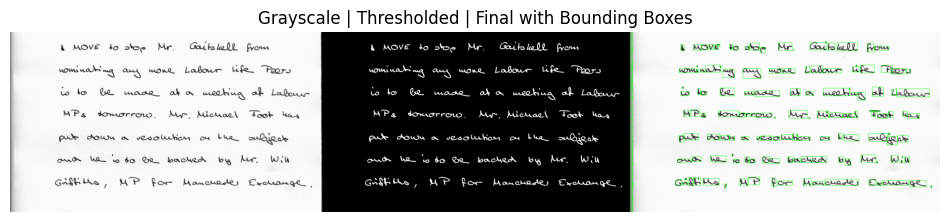
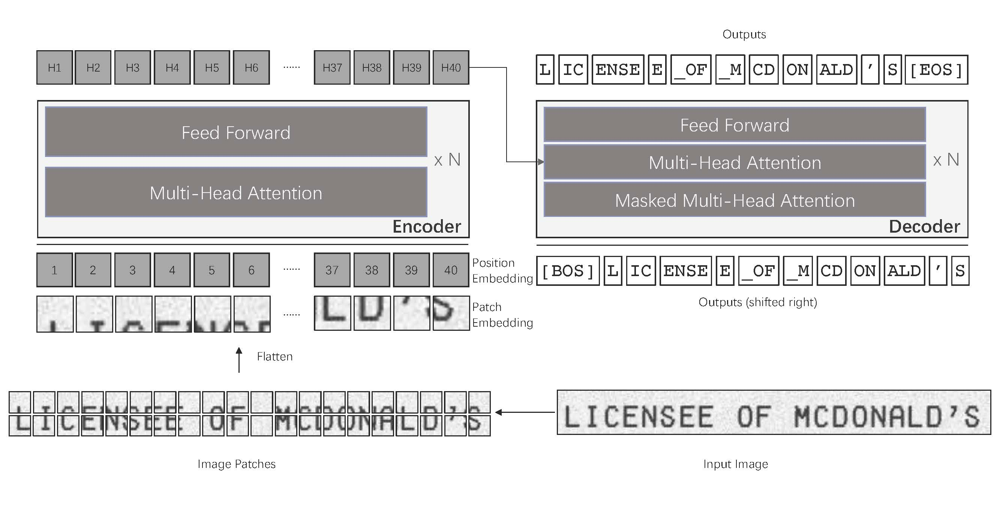

# MedIntel

## Overview

**MedIntel** is a cutting-edge AI-driven system designed to streamline medical documentation and radiology analysis. This system enhances the workflow of healthcare professionals by converting handwritten and printed prescriptions into editable digital formats and providing AI-powered insights for radiological X-ray images. 

MedIntel aims to reduce time spent on manual data entry and improve diagnostic accuracy by leveraging state-of-the-art technologies in image recognition and artificial intelligence.

## Key Features

### 1. Handwritten Text Recognition
- **Input**: Upload handwritten medical notes or prescriptions.
- **Output**: The system digitizes the handwritten content, converting it into editable text. Users can easily modify the extracted text to correct any inaccuracies.
  
### 2. Printed Prescription Analysis
- **Input**: Upload digital images of printed medical prescriptions.
- **Output**: Extracted text from the prescription is displayed for review and correction, offering a seamless way to digitize printed medical data.

### 3. Radiology X-ray Image Analysis
- **Input**: Upload one or two X-ray images (one compulsory and one optional).
- **Output**: MedIntel provides AI-powered insights for uploaded X-ray images, helping to highlight key diagnostic features and radiological findings. Both images are processed and displayed if uploaded, or analysis is done on the single provided image.

## How It Works

1. **Upload**: Users can upload images of handwritten or printed prescriptions and X-ray scans through a user-friendly interface.
2. **Processing**:
   - For X-ray images, MedIntel employs AI models trained to recognize key radiological patterns and provide detailed diagnostic information.
   - For handwritten and printed text, the system uses advanced Optical Character Recognition (OCR) techniques optimized for medical data to extract and convert text.
3. **Editable Output**: The recognized text from prescriptions is shown in an editable field, allowing users to correct any extraction errors.
4. **AI-Driven Insights**: For radiological analysis, the system offers an interpretation of the X-ray, identifying critical elements that support medical decision-making.

## Installation

To install and set up the MedIntel system on your local environment, follow these steps:

### Clone the Repository
```
git clone https://github.com/Dhruvanshu-Joshi/MedIntel.git
cd MedIntel
```

### Prerequisites

```
pip intall -r requirements.txt
```

### Prerequisites

```
python app.py
```

The system will now be accessible at [localhost:5000](http://localhost:5000/)

## Technicalities

### 1. Handwritten Text Recognition (HTR)

The MedIntel system incorporates a highly efficient **Handwritten Text Recognition (HTR)** pipeline for digitizing handwritten medical prescriptions and notes. The pipeline leverages modern computer vision techniques for detecting and reading words from scanned documents or images.

#### Key Features:
- **Word Detection**: Identifies the location of each word within the handwritten document using a deep learning-based word detector.
- **Text Recognition**: Once the words are detected, they are processed through an OCR model that reads and converts them into digital text format.
- **Parameter Customization**: 
  - **Scale**: Optimizes the detection of text at a height of 50px, adjustable for resizing images and improving accuracy.
  - **Margin**: Adds extra pixels around detected words to enhance recognition, particularly in dense writing.
  - **Line Clustering**: Configurable to group detected words into coherent lines, filtering out single-word false positives.

### Alternaive Explored: TrOCR / EasyOCR

The handwritten text recognition (HTR) pipeline processes scanned handwritten documents with the following key features:

#### **Preprocessing Steps**:

- **Image Conversion**: Each input image is converted to grayscale to simplify the analysis.
- **Adaptive Thresholding**: This technique is employed to address lighting variations in the images, enhancing the contrast between the text and the background.
- **Contour Detection**: Connected components (words) are identified using contour detection, which helps in locating and isolating text areas within the image.
- **Bounding Box Generation**: Bounding boxes are created around detected contours, with padding applied to ensure that the entire word is captured.



#### **Box Merging**:
- **Overlap Detection**: A function identifies and merges overlapping bounding boxes to consolidate multiple detections into single coherent text regions.

#### **Text Recognition with TrOCR**:

- The merged boxes are processed using the TrOCR model, which employs a Transformer-based architecture for both image understanding and wordpiece-level text generation. Unlike traditional OCR systems that utilize Convolutional Neural Networks (CNNs) and Recurrent Neural Networks (RNNs), TrOCR leverages pretrained image and text Transformers for efficient text recognition. The model processes images resized to 384x384 pixels, splitting them into 16x16 patches. The text recognition task is framed as an encoder-decoder problem, achieving state-of-the-art performance on printed, handwritten, and scene text recognition tasks without requiring complex pre/post-processing steps.



#### **EasyOCR Integration**:

- EasyOCR is a Python-based Optical Character Recognition (OCR) module designed for ease of use, making it accessible even to those without extensive backgrounds in OCR or computer vision. It enables efficient text extraction from images and scanned documents through three key components: **Feature Extraction**, which employs ResNet and VGG deep learning models to convert images into usable feature sets; **Sequence Labeling**, which utilizes Long Short-Term Memory (LSTM) networks to interpret the sequential context of extracted features; and **Decoding**, which applies the Connectionist Temporal Classification (CTC) algorithm to translate labeled sequences into recognizable text. 


---

### 2. Printed Text Extraction Using PyTesseract

MedIntel also processes **printed prescriptions and documents** using the widely adopted **PyTesseract**, a pre-trained Optical Character Recognition (OCR) engine that specializes in converting printed text into digital format. This functionality is vital for extracting structured data from printed prescriptions.

#### Technical Approach:
- **OCR Model**: PyTesseract is employed for printed text extraction, ensuring high accuracy without the need for custom training. The system is tuned for high-quality image pre-processing and efficient text extraction.
  
- **Preprocessing Steps**:
  - **Image Grayscaling**: Converts the prescription images into grayscale format with 2 channels, which significantly improves the OCR performance by reducing noise.
  - **Thresholding**: Adaptive thresholding ensures that even varying levels of brightness in printed documents are handled appropriately to maintain extraction quality.
  
- **Text Structuring**: After extraction, the text is analyzed and structured, allowing for easy identification of key fields such as patient information, medication details, and dosages. This is essential for integrating extracted data into clinical systems and ensuring that prescription details are accurate.

---

### 3. Image Captioning on Chest X-ray

MedIntel’s AI-powered chest X-ray analysis system generates automated **medical impressions** from chest X-ray images, reducing the time radiologists spend writing reports by providing an initial draft of the clinical impression.

#### Objective:
Automatically generate the **Impression** section of chest X-ray reports using deep learning models. The impressions summarize key clinical findings from the image, allowing healthcare professionals to quickly assess the results.

#### Technical Approach:
- **Data Source**: Trained on the **Indiana University Chest X-ray dataset**, which contains chest X-rays and corresponding XML-based reports.
- **Model Architecture**: Utilizes a custom **Encoder-Decoder architecture** with an attention mechanism for extracting important visual features from the X-ray and generating medical impressions.
  - **Encoder**: Extracts key features from the X-ray images.
  - **Attention Mechanism**: Focuses on relevant regions in the X-ray, enhancing the model’s ability to interpret medical abnormalities.
  - **Decoder**: Converts the extracted visual features into coherent medical impressions.


---

MedIntel's AI-driven systems streamline both the digitization of handwritten medical notes and the analysis of printed prescriptions and radiology images. These systems are designed to alleviate the workload of healthcare professionals while ensuring high accuracy and seamless integration into clinical workflows.


## Screens


## Demo

[demo1.webm](https://github.com/user-attachments/assets/7b312ae1-a93f-4b9d-b35c-e64aaa5ea992)

[demo2.webm](https://github.com/user-attachments/assets/f0c6e1a9-ab36-4d99-bea4-9bf3ac5f5853)

[demo3.webm](https://github.com/user-attachments/assets/5ca7c051-6714-427c-b665-e364ed2697fc)

[demo4.webm](https://github.com/user-attachments/assets/1807ba22-c734-4c9a-b386-f8ec870e8d61)

Demo videos also available in the resource directory.

### Conclusion

In this system, we explored three methods for handwritten text recognition: **HTR_pipeline**, **TRocr**, and **EasyOCR**. After thorough experimentation, we selected **HTR_pipelining** as the most effective solution for accurately recognizing handwritten text in the MedIntel system. For printed text recognition, **pytesseract** was used due to its high accuracy and efficiency with typed text. Additionally, for radiology X-ray reports, we implemented an **image captioning** model tailored specifically for extracting detailed descriptions from medical imagery. This combination of specialized tools allows MedIntel to offer a comprehensive, efficient solution for medical text and image analysis.
